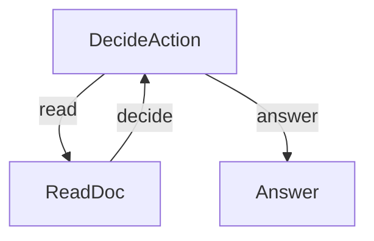

# Agentic RAG

An agent-driven Retrieval Augmented Generation system where the LLM decides which documents to read before answering. Instead of blindly retrieving top-K chunks, the agent inspects document summaries and strategically picks which ones to dive into, accumulating context until it has enough information to answer.

## Features

- Agent-driven retrieval: the LLM decides *what* to read, not just a similarity score
- Iterative context building: reads one document at a time, re-evaluating after each
- Structured YAML output for reliable action parsing
- Clean decision loop using PocketFlow's action-based branching

## Getting Started

1. Install dependencies:

```bash
pip install -r requirements.txt
```

2. Set your OpenAI API key:

```bash
export OPENAI_API_KEY="your-api-key-here"
```

3. Test that your API key works:

```bash
python utils.py
```

4. Run with the default question:

```bash
python main.py
```

5. Ask your own question with the `--` prefix:

```bash
python main.py --"What is the ReAct pattern and how does PocketFlow support it?"
```

## How It Works

The agent loops between deciding and reading until it has enough context to answer:



1. **DecideAction**: The LLM examines the question, available documents, and context gathered so far. It outputs a YAML decision: either `read` (with a document name) or `answer`.
2. **ReadDoc**: Retrieves the chosen document's content and appends it to the accumulated context, then loops back to DecideAction.
3. **Answer**: Once the agent decides it has enough context, generates a final answer using all gathered information.

### File Structure

- [`main.py`](./main.py): Entry point — parses CLI args, runs the flow, prints the answer
- [`flow.py`](./flow.py): Connects DecideAction, ReadDoc, and Answer into an agentic loop
- [`nodes.py`](./nodes.py): Node implementations with prep/exec/post pattern
- [`utils.py`](./utils.py): LLM helper function and document store
- [`requirements.txt`](./requirements.txt): Python dependencies

## Example Output

```
🤔 Question: How do nodes work in PocketFlow?

  🔍 Agent decides to read 'nodes'
  📄 Reading document: nodes
  ✅ Added 'nodes' to context
  💡 Agent decides it has enough context to answer
  ✍️ Generating answer...

🎯 Final Answer:
In PocketFlow, nodes have three stages: prep (reads shared store),
exec (performs work, including LLM calls, and retries on failure),
and post (writes back to the store). BatchNode handles lists of items.
```
