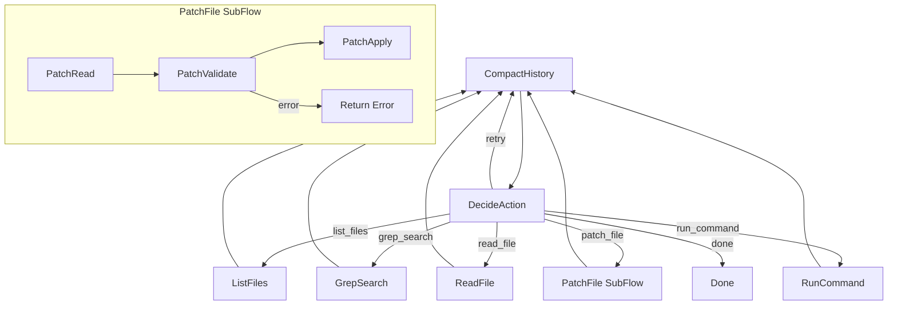

# Coding Agent

A production-ready coding agent built with PocketFlow that autonomously implements skeleton code to make failing tests pass. It uses an LLM-driven tool loop with 6 tools, persistent memory across sessions, and project-specific skills loading.

## Features

- **6 Tools**: `list_files`, `grep_search`, `read_file`, `patch_file`, `run_command`, `done`
- **Memory**: Saves learnings from past sessions to `.memory.md` for future runs
- **Skills**: Loads project-specific rules from `AGENTS.md` if present
- **Patch SubFlow**: `patch_file` implemented as a Flow-IS-Node SubFlow (Read -> Validate -> Apply) with fuzzy matching for error recovery
- **History Compaction**: Automatically summarizes long histories to stay within context limits
- **One Node Per Tool**: Clean routing architecture with dedicated nodes for each tool

## Getting Started

1. Install dependencies:
```bash
pip install -r requirements.txt
```

2. Export your OpenAI API key:
```bash
export OPENAI_API_KEY=your-api-key-here
```

3. Test the LLM connection:
```bash
python utils/call_llm.py
```

4. Run the coding agent:
```bash
python main.py
```

The agent will create a test project with a mini SQL engine (tokenizer, parser, executor) and autonomously implement all skeleton functions to make the tests pass.

## How It Works



The agent operates in a loop:
1. **CompactHistory** compresses old history entries to avoid context overflow
2. **DecideAction** sends the task, history, memory, and skills to the LLM, which picks one tool
3. The chosen **tool node** executes the action and records the result
4. Loop back to step 1 until the LLM calls `done` or max steps reached

## Files

| File | Description |
|------|-------------|
| `main.py` | Entry point — sets up test project and runs the agent |
| `flow.py` | Defines the agent flow with tool routing and PatchFile SubFlow |
| `nodes.py` | All node implementations (CompactHistory, DecideAction, tool nodes, patch SubFlow) |
| `utils/call_llm.py` | OpenAI GPT-4o wrapper |
| `setup_test_project.py` | Creates a mini SQL engine project with skeleton code and tests |
| `requirements.txt` | Python dependencies |

## Example Output

```
🤖 Coding Agent starting...
📋 Task: Implement the skeleton functions to make all tests pass.
📁 Working in: test_project/

  🔧 [1] run_command — Run the tests to see what's failing
  ✅ 20 passed, 48 failed

  🔧 [2] read_file — Read db.py to understand the skeleton
  ✅ (file contents displayed)

  🔧 [3] patch_file — Implement parse_select()
  ✍️ Patched db.py

  🔧 [4] patch_file — Implement parse_select_columns()
  ✍️ Patched db.py

  ...

  🔧 [15] run_command — Run tests again
  ✅ 68 passed, 0 failed

  🔧 [16] done — All tests pass!

🎯 Result: All 68 tests pass. Implemented parser and executor functions.
```
