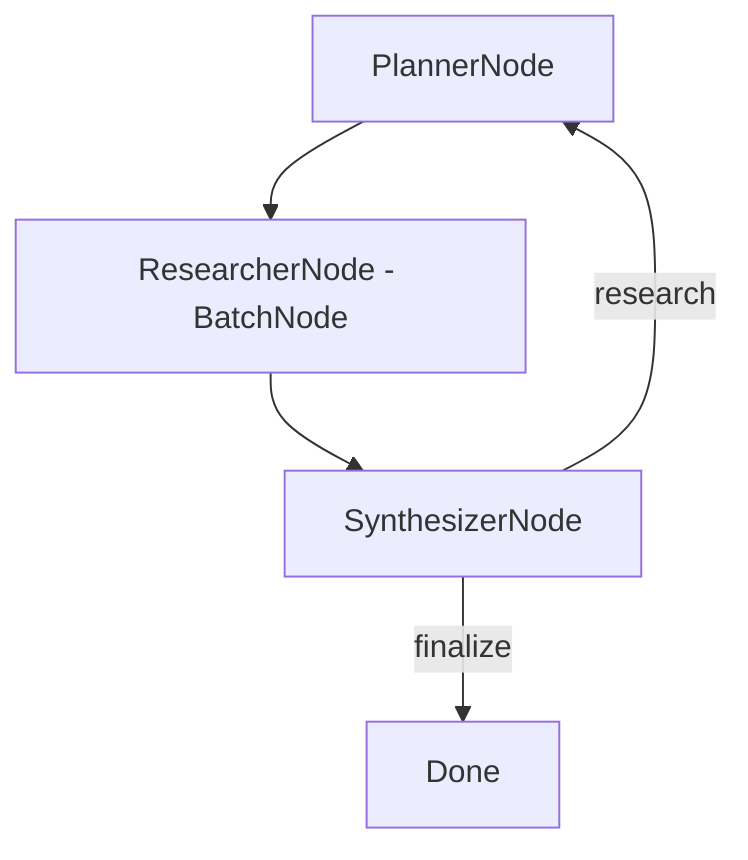

# Deep Research

A recursive map-reduce research agent that iteratively searches the web, extracts facts, and synthesizes a comprehensive report. The agent plans search queries, gathers information in parallel via batch processing, and loops back to fill knowledge gaps until the report is complete.

## Features

- Generates diverse search queries with an LLM-powered planner
- Batch-searches the web and extracts key facts from each result
- Iteratively identifies knowledge gaps and refines research (up to 2 loops)
- Produces a final markdown report once sufficient information is gathered

## Getting Started

1. Install dependencies:

```bash
pip install -r requirements.txt
```

2. Set your OpenAI API key:

```bash
export OPENAI_API_KEY="your-api-key-here"
```

3. Test that your API key and search are working:

```bash
python utils.py
```

4. Run the deep research flow with the default topic:

```bash
python main.py
```

5. Research your own topic using the `--` prefix:

```bash
python main.py --"The impact of AI on healthcare diagnostics"
```

## How It Works



1. **PlannerNode**: Generates 3 diverse search queries based on the topic (or knowledge gaps from previous loops)
2. **ResearcherNode** (BatchNode): Searches the web for each query and uses the LLM to extract key facts
3. **SynthesizerNode**: Evaluates whether the collected notes are sufficient for a comprehensive report. If gaps remain and fewer than 2 loops have run, it sends feedback back to the planner. Otherwise, it generates the final report.

File structure:
- [`main.py`](./main.py): Entry point that accepts a topic and runs the flow
- [`flow.py`](./flow.py): Wires PlannerNode, ResearcherNode, and SynthesizerNode into a loop
- [`nodes.py`](./nodes.py): The three core nodes (plan, research, synthesize)
- [`utils.py`](./utils.py): Helper functions for LLM calls and web search

## Example Output

```
🤔 Researching: The current state of quantum computing in 2025

  🔍 Planner: ['quantum computing 2025 progress and challenges',
               'quantum computing hardware and software development 2025',
               'quantum computing market forecast 2025 key players']
  🌐 Searching: quantum computing 2025 progress and challenges
  🌐 Searching: quantum computing hardware and software development 2025
  🌐 Searching: quantum computing market forecast 2025 key players
  📚 Researcher: collected 3 sets of notes
  🤔 Synthesizer: gaps found — need more on error correction, talent pool...

  🔍 Planner: ['quantum error correction 2025 fault tolerance',
               'quantum computing talent pool skills gap education',
               'quantum cybersecurity implications post-quantum cryptography']
  🌐 Searching: ...
  📚 Researcher: collected 3 sets of notes
  ✅ Synthesizer: report complete

📄 Final Report:

## The State of Quantum Computing in 2025

The quantum computing market is projected to reach $3.52 billion in 2025.
Superconducting and trapped ion technologies lead the qubit landscape...
```
