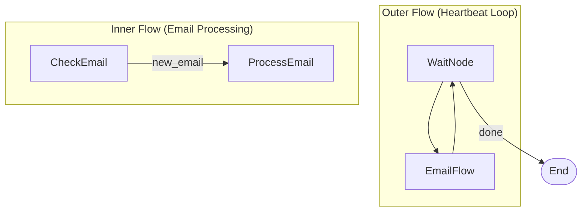

# Heartbeat Monitor

A periodic monitoring agent that stays alive and polls for new work on a schedule. This is the **"open claw" pattern** -- your agent doesn't just run once and exit; it keeps running, watching, and acting whenever something needs attention.

This is how real always-on AI automation works: email monitoring, deployment health checks, Slack watchers, database change detectors, CI/CD pipeline monitors. Any time you need an AI agent that runs continuously and reacts to the world, this is the pattern.

## Why This Pattern Matters

Most AI examples are one-shot: ask a question, get an answer, done. But production systems need agents that **stay alive**. Think about:

- **Email monitoring**: Summarize and triage incoming messages every few minutes
- **Deployment watchers**: Check health endpoints and alert on failures
- **Slack/chat monitors**: Watch channels and auto-respond or escalate
- **Database monitors**: Detect anomalies in metrics and trigger alerts
- **CI/CD watchers**: Monitor build pipelines and notify on failures

The heartbeat pattern gives you a clean, composable way to build all of these. The outer loop handles timing and lifecycle; the inner flow handles the actual work. Swap out the inner flow and you have a completely different monitor.

## Features

- **Nested flows**: Demonstrates PocketFlow's most powerful feature -- Flow IS a Node, so flows compose inside flows
- **Periodic polling**: Outer heartbeat loop with configurable cycle count
- **Conditional processing**: Inner flow only processes emails when new ones arrive
- **LLM-powered summaries**: Uses GPT-4o to summarize emails and suggest reply actions
- **Clean lifecycle**: Graceful shutdown after N cycles with accumulated results

## Getting Started

1. Install dependencies:

```bash
pip install -r requirements.txt
```

2. Set your OpenAI API key:

```bash
export OPENAI_API_KEY="your-api-key-here"
```

3. Test that your API key works:

```bash
python utils.py
```

4. Run with the default 4 cycles:

```bash
python main.py
```

5. Run with a custom number of cycles:

```bash
python main.py --cycles=6
```

## How It Works

The system uses **nested flows** -- one of PocketFlow's most powerful features. A `Flow` is also a `Node`, so you can plug an entire flow into another flow as a single step.



1. **WaitNode**: Sleeps for the polling interval (2 seconds), increments the cycle counter. Returns `"done"` after max cycles to stop the loop.
2. **EmailFlow** (nested): Runs as a single step in the outer flow.
   - **CheckEmail**: Checks the simulated inbox. If empty, the inner flow ends. If emails are found, routes to ProcessEmail.
   - **ProcessEmail**: Uses the LLM to summarize each email and suggest a reply action.
3. After the inner EmailFlow completes, control returns to WaitNode and the loop continues.

### File Structure

- [`main.py`](./main.py): Entry point -- parses CLI args, runs the heartbeat flow
- [`flow.py`](./flow.py): Builds the nested flow structure (outer heartbeat + inner email processing)
- [`nodes.py`](./nodes.py): WaitNode, CheckEmail, and ProcessEmail implementations
- [`utils.py`](./utils.py): LLM helper function and simulated email inbox
- [`requirements.txt`](./requirements.txt): Python dependencies

## Example Output

```
🚀 Starting Heartbeat Email Monitor
   Polling every 2 seconds for 4 cycles...

--- 💓 Heartbeat 1 ---
  📭 No new emails.

--- 💓 Heartbeat 2 ---
  📬 1 new email(s)!
  💡 The boss is requesting the Q3 numbers by Friday.
     Reply action: Confirm receipt and send numbers by Thursday.

--- 💓 Heartbeat 3 ---
  📭 No new emails.

--- 💓 Heartbeat 4 ---
🛑 Max cycles reached. Stopping.

✅ Monitor stopped.
📊 Total emails processed: 1
```
