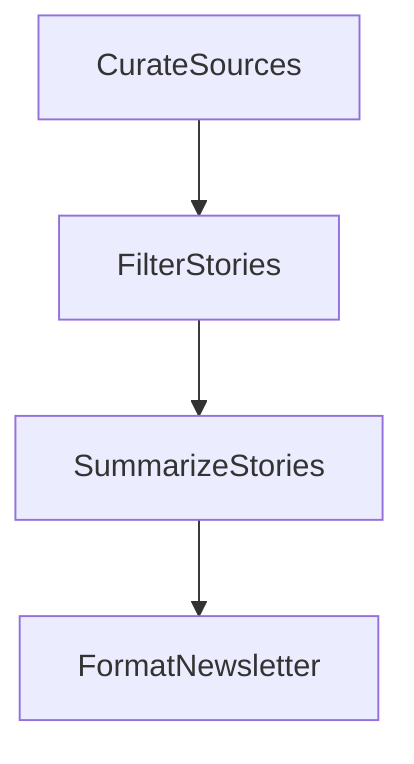

# AI Newsletter

An AI-powered newsletter curation pipeline that searches the web for trending AI topics, selects the most interesting stories, writes punchy blurbs, and formats everything into a polished markdown digest.

## Features

- Searches multiple AI topics via DuckDuckGo
- LLM-powered story selection scored on novelty, practitioner impact, and concrete details
- Generates engaging 2-3 sentence blurbs for each story
- Outputs a formatted markdown newsletter ready to publish

## Getting Started

1. Install dependencies:

```bash
pip install -r requirements.txt
```

2. Set your OpenAI API key:

```bash
export OPENAI_API_KEY="your-api-key-here"
```

3. Test that your API key and search are working:

```bash
python utils.py
```

4. Run the newsletter pipeline with default topics:

```bash
python main.py
```

5. Add extra topics using the `--` prefix:

```bash
python main.py --"open source LLM releases this week"
```

## How It Works



1. **CurateSources**: Searches the web for each topic (AI agents, LLM benchmarks, AI funding) and collects raw results
2. **FilterStories**: Uses the LLM to pick the 4 most interesting stories from all results
3. **SummarizeStories**: Writes a punchy 2-3 sentence newsletter blurb for each selected story
4. **FormatNewsletter**: Assembles the stories into a clean markdown newsletter

File structure:
- [`main.py`](./main.py): Entry point that accepts optional extra topics and runs the flow
- [`flow.py`](./flow.py): Wires the four nodes into a linear pipeline
- [`nodes.py`](./nodes.py): The four core nodes (curate, filter, summarize, format)
- [`utils.py`](./utils.py): Helper functions for LLM calls and web search

## Example Output

```
🤔 Curating newsletter from 3 topics...

  🔍 Searching: AI agents framework news this week
  🔍 Searching: LLM benchmark results 2025 2026
  🔍 Searching: AI startup funding rounds this month
  📚 Curated 3 topic searches
  💡 Selected 4 stories
  ✍️ Summarized 4 stories
  ✅ Newsletter formatted

📰 Newsletter:

# AI Weekly Digest

## 1. Meta Open-Sources HyperAgents Framework
Meta just dropped HyperAgents, an open-source framework letting AI
rewrite its own code! This self-improving AI achieved a 3x performance
boost on coding benchmarks.

## 2. Microsoft's Agent Operations Roadmap
Microsoft is laying out the plan for AI to evolve from Copilot to fully
autonomous agents in the enterprise.

## 3. OpenClaw Agents Inspire Industry Giants
OpenClaw's minimal-safety-net approach is shaking up the AI agent world,
with Nvidia, Anthropic, and others buzzing about less-restricted agents.

## 4. OpenAI Raises $10B for Foundational AI
OpenAI just landed another $10 billion, solidifying their position at
the forefront of the AI revolution.
```
