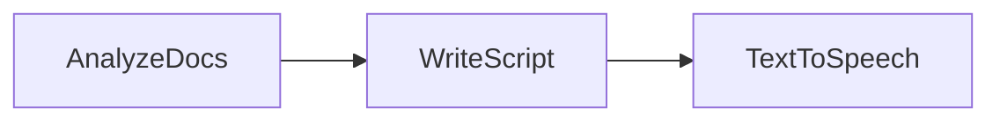

# NotebookLM-Style Podcast Generator

Turn any collection of documents into a two-host conversational podcast, inspired by Google's NotebookLM. An LLM extracts the most interesting nuggets, writes a natural-sounding script, and OpenAI TTS voices it.

## Features

- Analyzes source documents and extracts surprising, discussion-worthy nuggets
- Generates a conversational podcast script between two hosts (Alex and Jamie)
- Converts the script to audio using OpenAI TTS with distinct voices per host
- Outputs a single MP3 file ready to listen

## Getting Started

1. Install dependencies:
```bash
pip install -r requirements.txt
```

2. Set your OpenAI API key:
```bash
export OPENAI_API_KEY="your-api-key-here"
```

3. Test your API key:
```bash
python utils.py
```

4. Generate a podcast:
```bash
python main.py
```

5. Specify a custom output filename:
```bash
python main.py --my-episode.mp3
```

## How It Works



1. **AnalyzeDocs** — Reads source documents and extracts 2-3 interesting nuggets from each
2. **WriteScript** — Generates a ~12-line conversational podcast script between Alex and Jamie
3. **TextToSpeech** — Converts each script line to speech (Alex = alloy voice, Jamie = echo voice) and concatenates into one audio file

## Files

- [`main.py`](./main.py) — Entry point; runs the pipeline and saves the podcast
- [`flow.py`](./flow.py) — Wires the three nodes into a linear chain
- [`nodes.py`](./nodes.py) — AnalyzeDocs, WriteScript, TextToSpeech
- [`utils.py`](./utils.py) — `call_llm` and `text_to_speech` helpers, sample documents

## Example Output

```
🎧 Starting Podcast Generation Pipeline

🔍 Step 1 — Analyzing documents for interesting nuggets
✍️  Step 2 — Writing conversational podcast script
🎙️  Step 3 — Converting script to audio with TTS

  🔍 Extracted nuggets from 4 documents
  ✍️  Generated script with 12 lines
    Alex: Alright Jamie, buckle up. I've been diving into something called PocketFlow...
    Jamie: Okay... frameworks are usually bulky, right? What's so special?
    Alex: This one claims to be just 100 lines of code. A *complete* LLM framework.
    Jamie: A hundred lines?! That sounds like a typo!
    Alex: And get this: zero dependencies and vendor lock-in.
    Jamie: Hold on, that's... impressive, if true.
    ...
    🎙️  Generating audio for Alex (line 1/12)...
    🎙️  Generating audio for Jamie (line 2/12)...
    ...
    🎙️  Generating audio for Jamie (line 12/12)...
  ✅ Audio saved to podcast.mp3

==================================================
🎧 Podcast saved to: podcast.mp3
==================================================
```
