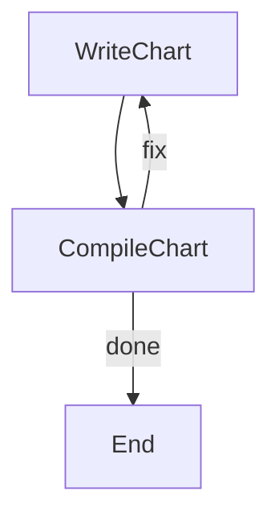

# Self-Healing Mermaid Diagram Generator

A PocketFlow cookbook example that generates Mermaid diagrams from natural language descriptions, with automatic error recovery. If the generated diagram fails to compile, it feeds the error back to the LLM and retries up to 3 times.

## Features

- **Natural Language to Diagram**: Describe what you want and GPT-4o generates valid Mermaid syntax
- **Self-Healing Loop**: Compilation errors are fed back to the LLM for automatic correction
- **Max Retry Limit**: Stops after 3 failed attempts to avoid infinite loops
- **Mermaid CLI Validation**: Uses the official mermaid-cli (mmdc) to verify syntax

## Getting Started

1. Install dependencies:
    ```bash
    pip install -r requirements.txt
    ```

2. Make sure Node.js is installed (required for mermaid-cli):
    ```bash
    node --version
    ```

3. Set your OpenAI API key:
    ```bash
    export OPENAI_API_KEY="your-api-key-here"
    ```

    Quick check to make sure your API key works:
    ```bash
    python utils.py
    ```

4. Run the diagram generator:
    ```bash
    python main.py
    ```

    Or provide a custom description:
    ```bash
    python main.py "--A sequence diagram showing user login with OAuth: user clicks login, redirect to provider, auth callback, token exchange, session created"
    ```

## How It Works



1. **WriteChart**: Sends the task description (plus any previous error feedback) to GPT-4o, which generates Mermaid diagram code
2. **CompileChart**: Writes the code to a temp file and runs `npx mmdc` to compile it
   - If compilation **succeeds** -> returns `"done"`, flow ends
   - If compilation **fails** -> records the error, returns `"fix"`, loops back to WriteChart with the error context
   - After **3 failed attempts** -> returns `"done"`, flow ends with failure

## Files

- [`main.py`](./main.py): Entry point with CLI argument parsing
- [`flow.py`](./flow.py): Defines the self-healing flow with retry loop
- [`nodes.py`](./nodes.py): WriteChart and CompileChart node implementations
- [`utils.py`](./utils.py): OpenAI GPT-4o API wrapper
- [`requirements.txt`](./requirements.txt): Python dependencies

## Example Output

```
🎨 PocketFlow Self-Healing Mermaid Generator

🤔 Task: A flowchart showing a CI/CD pipeline: code push triggers build,
   then test and lint, then deploy to staging, manual approval, deploy to production

✍️  Generating Mermaid diagram...
  Generated chart (282 chars)
🔍 Compiling Mermaid diagram...
  Compiled successfully! ✅

=== Result ===
  Status: SUCCESS (first attempt)

  Mermaid code:

    graph LR
        A[Code Push] --> B(Build);
        B --> C{Test & Lint};
        C --> D[Deploy to Staging];
        D --> E{Manual Approval};
        E -- Yes --> F[Deploy to Production];
        E -- No --> G[Rollback];
```
